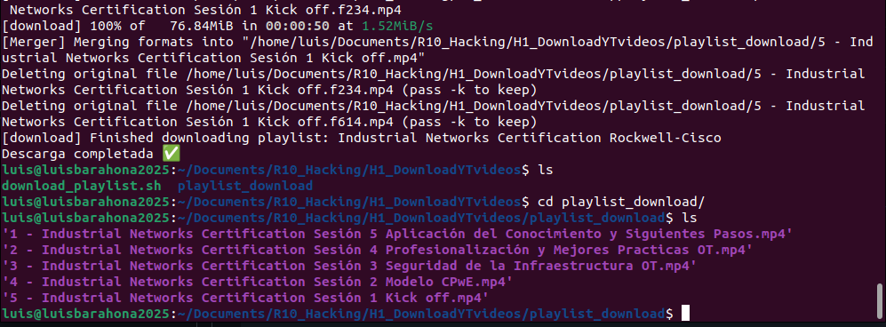

# 📥 Descarga Automatizada de Videos de un Playlist de YouTube (Ubuntu 22.04)

Este documento describe cómo automatizar la descarga de los primeros 5 videos de un playlist de YouTube utilizando `yt-dlp` en Ubuntu 22.04.

---

## 🚀 Objetivo

Descargar automáticamente los primeros 5 videos del siguiente playlist:

```

[https://www.youtube.com/playlist?list=PL46X1WcXSqYEZiSEmsSMEhSiH91182q9K](https://www.youtube.com/playlist?list=PL46X1WcXSqYEZiSEmsSMEhSiH91182q9K)

````

---

## 🔧 Requisitos

- Sistema operativo: Ubuntu 22.04
- Conexión a internet
- Permisos de superusuario (`sudo`)

---

## 📦 Instalación de dependencias

Ejecuta los siguientes comandos para instalar las herramientas necesarias:

```bash
sudo apt update
sudo apt install -y yt-dlp ffmpeg
````

---

## 📜 Script de descarga

Crea un archivo llamado `download_playlist.sh`:

```bash
#!/bin/bash

# URL del playlist
PLAYLIST_URL="https://www.youtube.com/playlist?list=PL46X1WcXSqYEZiSEmsSMEhSiH91182q9K"

# Carpeta de salida
OUTPUT_DIR="$HOME/Videos/playlist_download"
mkdir -p "$OUTPUT_DIR"

echo "Descargando los primeros 5 videos..."

yt-dlp \
    --playlist-start 1 \
    --playlist-end 5 \
    -f "bestvideo+bestaudio/best" \
    --merge-output-format mp4 \
    -o "$OUTPUT_DIR/%(playlist_index)s - %(title)s.%(ext)s" \
    "$PLAYLIST_URL"

echo "Descarga completada ✅"
```

---

## ▶️ Ejecución del script

Dale permisos de ejecución y ejecútalo:

```bash
chmod +x download_playlist.sh
./download_playlist.sh
```

---

## ⚙️ Explicación de parámetros

| Parámetro                   | Descripción                          |
| --------------------------- | ------------------------------------ |
| `--playlist-start 1`        | Inicia desde el primer video         |
| `--playlist-end 5`          | Descarga solo los primeros 5 videos  |
| `-f bestvideo+bestaudio`    | Descarga la mejor calidad disponible |
| `--merge-output-format mp4` | Une audio y video en formato MP4     |
| `%(playlist_index)s`        | Numera automáticamente los archivos  |

---

## 🚀 Opciones avanzadas

### 🔁 Evitar descargas duplicadas

```bash
--download-archive downloaded.txt
```

---

### 🎧 Descargar solo audio (MP3)

```bash
-f bestaudio -x --audio-format mp3
```

---

### 📁 Cambiar directorio de salida

Modifica la variable:

```bash
OUTPUT_DIR="/ruta/personalizada"
```

---

## ⚠️ Notas importantes

* Usa siempre enlaces del tipo:

  ```
  https://www.youtube.com/playlist?list=...
  ```
* Evita enlaces con `watch?v=...&list=...`
* Asegúrate de tener suficiente espacio en disco

---

## 📸 Evidencia de ejecución

Aquí agregaré una captura de pantalla demostrando que el script funciona correctamente:





> (Subir imagen al repositorio y actualizar esta sección)

---

## 👨‍💻 Autor

Luis David Barahona Valdivieso  
Electronic Engineering  

---

## 🤖 Asistente

ChatGPT  
Modelo: GPT-5.3  

---

## ⚠️ Nota

Este repositorio tiene fines educativos.  
El contenido ha sido asistido por una Inteligencia Artificial.
